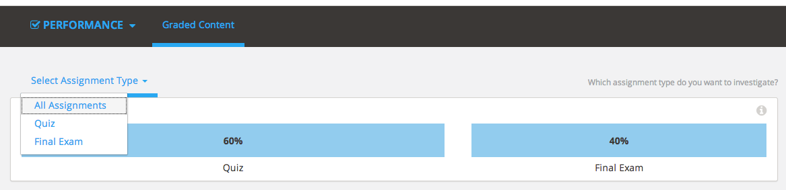
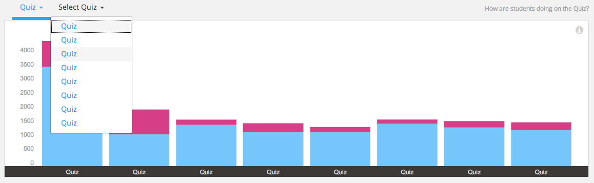
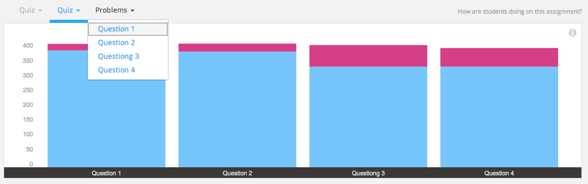
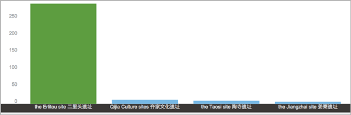

.. _Performance_Graded:

#############################
Graded Content Submissions
#############################

How are students answering questions? In edX Insights, graded content
submissions show you the responses that students submit for graded problems
and help you evaluate what they find difficult.

This chapter describes `Selecting the Assignment Type, Assignment, and
Problem`_ and `Gaining Insight into Graded Problems`_.

.. _Selecting the Assignment Type, Assignment, and Problem:

*******************************************************
Selecting the Assignment Type, Assignment, and Problem
*******************************************************

To access data about the answers that students submit for a graded problem
component, you make these selections.

Step 1: Select a graded course assignment type.

Step 2: Select an assignment. 

Step 3: Select a problem. (If necessary, you also select a problem part.)

EdX Insights provides aggregated data for each selection that you make. 

==================================
Step 1: Select an Assignment Type
==================================

After you select **Performance** and **Graded Content**, edX Insights displays
the assignment types that make up the grading configuration of the course. You
use the drop-down menu or click in this chart to select the assignment type to
investigate.

     assignment type contributes to the course grade

.. replacement needed

For information about defining course assignment types, see `Establishing a
Grading Policy`_.

==============================
Step 2: Select an Assignment 
==============================

After you select one of the course assignment types, edX Insights displays a
stacked bar chart that summarizes student performance on each assignment of
that type. You use the drop-down menu or click in the chart to select a
specific assignment to examine further.

     different colors for the number of correct and incorrect submissions

.. replacement needed

The report on this page provides the number of problems in each assignment and
the number of correct and incorrect submissions received for them.

For information about identifying the graded subsections in a course, see `Set
the Assignment Type and Due Date for a Subsection`_.

=========================
Step 3: Select a Problem
=========================

After you select a specific assignment, edX Insights displays a stacked bar
chart that summarizes student performance on each question in that problem.
You use the drop-down menu or click in the chart to select a specific problem
to examine further.

     with different colors for the number of correct and incorrect submissions

.. replacement needed

The report on this page provides the number of questions in each problem
and the number of correct and incorrect submissions received for them.

For information about adding a unit to a subsection, see `Create a Unit`_.

.. Because you can create a problem component that includes several problems, you might also need to select a problem part. 

For problem components that include more than one part, you use the drop-down
menu or click in the chart to select a part.

.. is there a chart? is there a report?

.. _Gaining Insight into Graded Problems:

*************************************
Gaining Insight into Graded Problems
*************************************

EdX Insights delivers submission data in a bar chart and a report that you can
view or download. Descriptions of the chart and report follow. For detailed
information about the computations, see :ref:`Reference`.

==================
Submissions Chart
==================

The bars on this chart represent the number of enrolled students who submitted
a particular answer to a question in a problem component. The x-axis includes
the most frequently submitted answers, up to a maximum of 12. Due to space
limitations, the answer text that is used to label the x-axis might be
truncated. Moving your cursor over each bar shows a longer version of the
answer.

To review the problem component in the LMS as a student sees it, click **View
Live** and then at the top of the page click **Staff View**. The LMS displays
the corresponding page in Student View. For more information, see `View Your
Live Course`_.

All submitted answers, and complete answer values, are available for review in
tabular format at the bottom of the page and can also be downloaded.

.. Examples of the graded content submissions chart follow. In the first example,

An example of the graded content submissions chart follows. In this example,
most students selected the correct answer for a multiple choice problem.

       out of four possible choices

.. TsinghuaX/00690242_1x/problem/268b43628e6d45f79c52453a590f9829/answerdistribution/i4x-TsinghuaX-00690242_1x-problem-268b43628e6d45f79c52453a590f9829_2_1/

.. TBD: The second example shows... 

.. second example - a more nuanced question? or one that might be misconstrued?

.. The last example is for a problem that has several parts. You use the list control above the chart to choose each of the parts. When you select a different part, both the chart and the report refresh with data for that problem part.

.. TBD: image to come

.. image of the first part of a multipart problem with the dropdown circled

.. note:: Problems that use the randomization setting in Studio result in 
 many possible submission variants, both correct and incorrect. As a result,
 edX Insights does not attempt to present a chart of responses to these
 problems. You can download the student submissions report to analyze the
 answers that are of interest.

For more information, see the :ref:`Reference`.

=====================
Submissions Report
=====================

A report with a row for each problem-answer combination submitted by your
students is available for review or download. The report columns show each
submitted answer, identify the correct answer or answers, and provide the
number of students who selected or provided that answer.

To download the Submissions report in a comma-separated value
file, click **Download CSV**.

The report and the file include one row for each problem-answer combination
submitted by a student. For example, consider a dropdown problem that has
five possible answers. The report or file contains up to five rows, one for
each answer selected by at least one student.

For problems that use the randomization feature in Studio, there is one row
for each problem-variant-answer combination selected by at least one student.
For more information about problem randomization, see `Randomization`_.

See the :ref:`Reference` for a detailed description of each column.

*******************************************************
Analytics in Action: Interpreting Graded Submissions
*******************************************************

A review of the distribution of student submissions for a graded problem can
lead to discoveries about your students and about your course.

* You can assess how difficult the problem is for students to answer correctly. 

* You can detect common mistakes.

* You can understand student misconceptions.

* You can find errors in problem components.

===============================================
Researching Unexpected Difficulties
===============================================

For problem types that provide both the question and a set of possible answers
(checkboxes, dropdown, and multiple choice), submission data helps you assess
how difficult it is for students to select the correct answer. With the
submissions chart, you can visually contrast the number of students who select
incorrect answers with the number who answer correctly.

If the number of students who answer the problem incorrectly surprises you,
research can reveal a variety of causes. Your investigation might begin with
some of these questions.

* Is the text of the question and of its possible answers clear? Has it been
  translated accurately?

* Does the course outline include relevant course content before the problem,
  or after it?

* Are all of the course prerequisites presented to potential students?

* Does the problem rely on student access to a video or textbook? Do students
  have access to alternatives: are there transcripts for the videos, and can
  the textbook files be read by a screen reader?

* Are students relying on conventional wisdom to answer the question instead
  of newly acquired knowledge?

The results of your investigation can guide changes to future course runs.

.. others?

=================================
Investigating Similar Responses
=================================

For open-ended problem types that provide only the question (numerical, text,
and math expression input), submission data can help you identify similar
responses. In the submissions report you have access to every answer submitted
by a student. The chart, however, presents only the 12 most frequently
submitted responses. Your initial investigation into how students answer a
question can begin with this manageably-sized set.

For example, you create a text input problem with a single correct answer,
"Warfarin". When you review its submissions chart, you notice that your
students submitted several similar, but incorrect, variations,including
"warfarin sodium" and "Warfarin or Coumadin". The report reveals several more
variations, including "WARFARIN", "Coumadin or Warfarin", and so on.

Reviewing the submitted answers for this question might reassure you that more
students understand the relevant course material than is indicated by the
number who actually provided the correct answer. If so, it might also prompt
you to update the problem so that the additional variations of the answer are
evaluated as correct. Alternatively, you might decide to revise the question
so that your parameters for the correct response are clearer, or change the
problem type to a more appropriate one.

=====================================================
Reviewing Answers to Test and Complete Course Setup
=====================================================

Before the release date of each section, you encourage your beta testers to
answer every question, and to submit both correct and incorrect answers.
You then use edX Insights to review the answers that your testers submit for
each problem. You verify that each problem is set up as you intend, and
correct any oversights before students can encounter them.

You also use edX Insights to validate the grading configuration, and to
proofread the display names, accessible labels, and text that identify
graded assignment types, assignments, problems, questions, and answers.

.. show examples like every subsection with a quiz is named Quiz, no accessible label for a problem -- also useful to show LMS?

.. _Randomization: http://edx.readthedocs.org/projects/edx-partner-course-staff/en/latest/creating_content/create_problem.html#randomization

.. _View Your Live Course: http://edx.readthedocs.org/projects/edx-partner-course-staff/en/latest/developing_course/testing_courseware.html?highlight=view%20live#view-your-live-course

.. _Establishing a Grading Policy: http://edx.readthedocs.org/projects/edx-partner-course-staff/en/latest/building_course/establish_grading_policy.html

.. _Set the Assignment Type and Due Date for a Subsection: http://edx.readthedocs.org/projects/edx-partner-course-staff/en/latest/developing_course/course_subsections.html#set-the-assignment-type-and-due-date-for-a-subsection

.. _Create a Unit: http://edx.readthedocs.org/projects/edx-partner-course-staff/en/latest/developing_course/course_units.html#create-a-unit